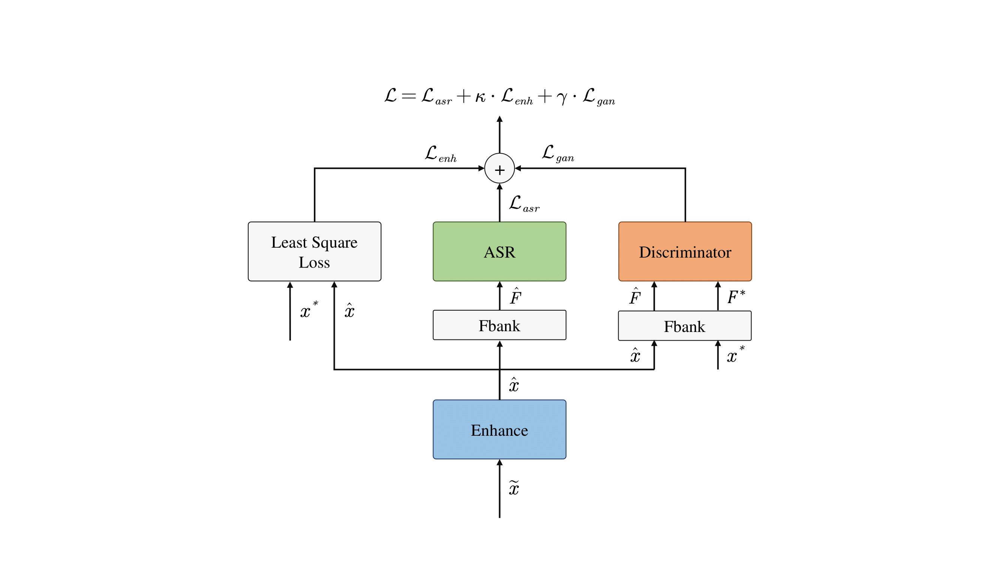

# joint training for ASR rnn_attention based model and conformer framework
The repository implements an ASR framework. We proposed a joint training network that contains an enhancement model a Fbank feature extraction model an End-to-End ASR model and a discriminant model. For comparson purpose we implement two End-to-End ASR models, RNN-Attention based model and conformer model. 
## Requirements
python 3,5 Pytorch 0.4.0
### Data
For evaluation the performance of the model, we use  AISHELL-1 to train and test the model, which is a Mandarin corpus. You can download the [AISHELL-1](http://www.aishelltech.com/kysjcp) online.  
For training the enhancement network, we use [NOISE-92](http://spib.linse.ufsc.br/noise.html) as the background noise.  
For language model training, we use a pretrained [open source chinese embeding vectors](https://github.com/Embedding/Chinese-Word-Vectors) as our initial embeding vectors in the language model. 
You can also use your own dataset. But the dataset must be splited into three parts train dev and test.   
## Framework

The input data of the enhancement model is 257 dimension STFT feature. Afterwards, the enhancement network will estimate a mask, which has the same size as the input data. The estimated clean signal is computed by element multipling the input data and the mask.  
The End-to-End network estimate the posteriori probabilites for ouptut sequence.    
In the joint training, an additional discriminant network is connected with the enhancement network, and can guide the enhancement network training towards true clean signal.  
## run the framework
you can run `run_att_model.sh` or `run_conformer_model` to train and test the model. The difference is different End-to-End network, RNN-Attention network or conformer model.  
The configrations for training and test stages are saved .yml files in config folder.   
You must change some path directions in `run_att_model.sh` and `run_conformer_model`.
## Results
clean speech test set for RNN-attention network:  
```
|------------------------------------------------------------------------------|
| SPKR    |  # Snt   # Wrd  |  Corr     Sub      Del     Ins      Err   S.Err  |
|---------+-----------------+--------------------------------------------------|
| Sum/Avg |  7176   104765  |  86.6    13.0      0.5     0.5     14.0    67.5  |
|==============================================================================|
```
noise speech test set for RNN-attention network: 
```
|------------------------------------------------------------------------------|
| SPKR    |  # Snt   # Wrd  |  Corr     Sub      Del     Ins      Err   S.Err  |
|---------+-----------------+--------------------------------------------------|
| Sum/Avg |  7176  104765  |  76.9      22.1     0.9      0.7    23.7    77.8  |
|==============================================================================|
```


